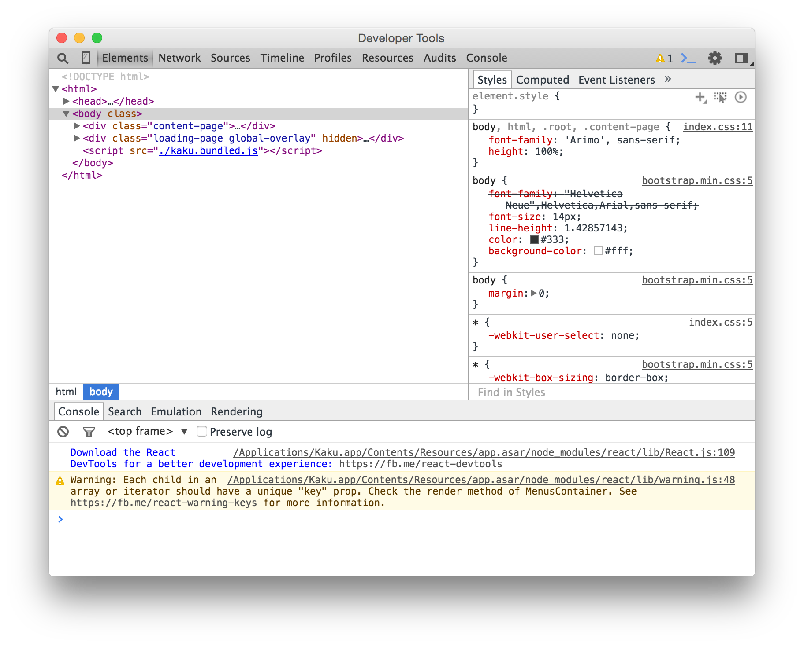
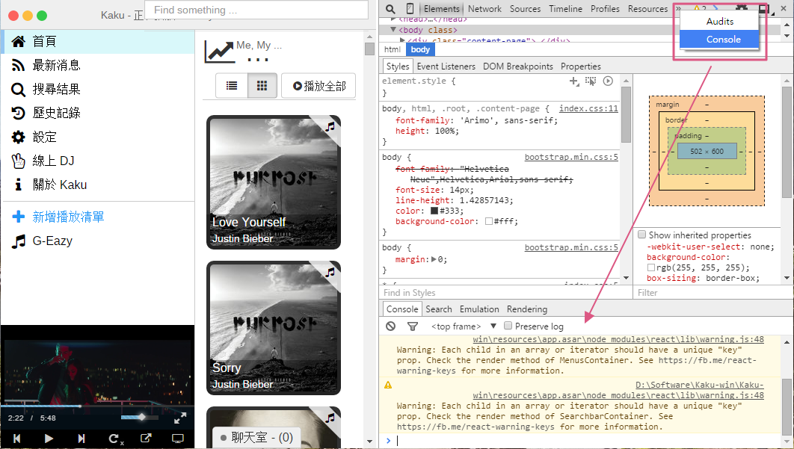
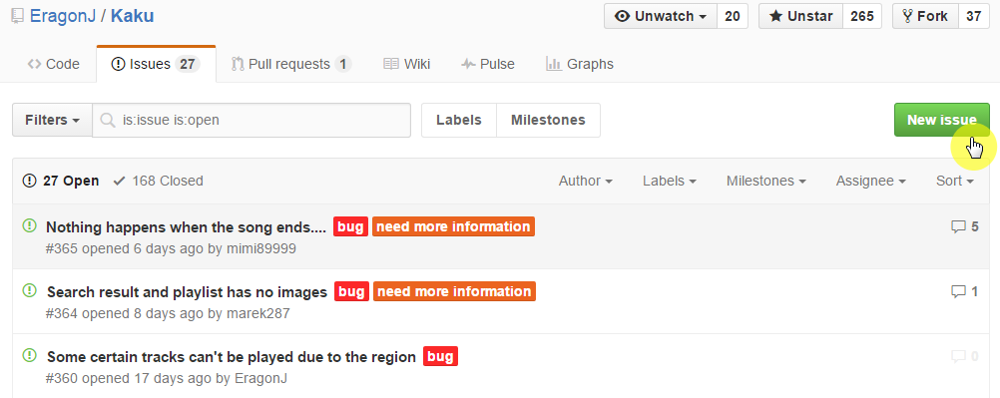
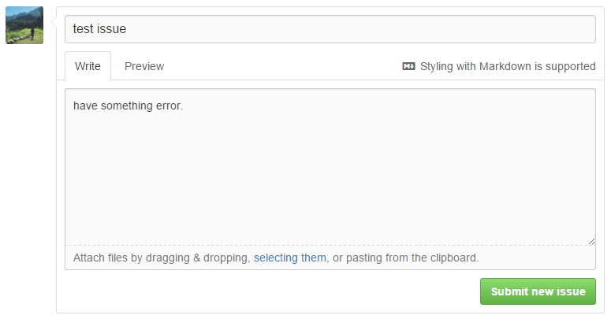

# 如何幫 Kaku 回報 Bug？

### 回報 Bug 方法細項
> - **重要：** 你必須要有一個 [Github](https://github.com) 帳號。
> - 提供問題的錯誤資訊如下：
  - Kaku 的版本。
  - 你的作業系統和系統版本。
  - 開啟 DevTools 切換到 **Console 面板**並且複製**錯誤訊息**：
    - Mac：<kbd>cmd + option + i</kbd>
    - Linux：<kbd>ctrl + alt + i</kbd>
    - Windows：<kbd>ctrl + alt + i</kbd>
  - 或許你可以透過截圖方式提供給我們更多的相關錯誤訊息。
> - 使用哪個平台來聆聽音樂。 _（Youtube、Vimeo、SoundCloud）_
> - 哪首歌曲會造成問題或者你可以透過`設定 -> 備份資料到本機端`的功能來輸出包含那首歌曲的播放清單，然後將播放清單傳送給我們作為 debug 使用。
> - 你發現在 UI 部分上有任何的錯誤。
> - 最後，你可以開一個新的 [issue](https://github.com/EragonJ/Kaku/issues) 來回報問題。

## 如何開啟 Debug 工具？
### Mac
按下 <kbd>cmd + option + i</kbd> 開啟：  

### Linux 和 Windows
按下 <kbd>ctrl + alt + i</kbd> 開啟：  

然後你可以從 **Console** 面板複製錯誤訊息。  

## 如何回報問題？

請到[這裡](https://github.com/EragonJ/Kaku/issues)提交一個新的 issue 回報給我們。  

1. Click **New Issue**  

2. 你可以寫下你的錯誤訊息或者是截圖貼在這裡，請使用 [Markdown](https://zh.wikipedia.org/wiki/Markdown) 格式，然後你可以點下 **Preview** 來預覽你所寫的內容，最後就可以提交問題囉！  

