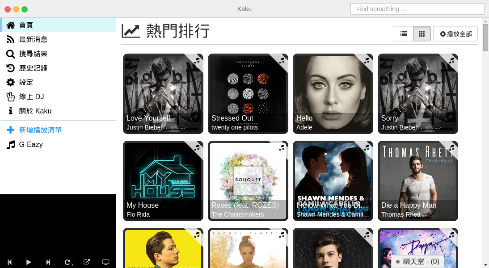
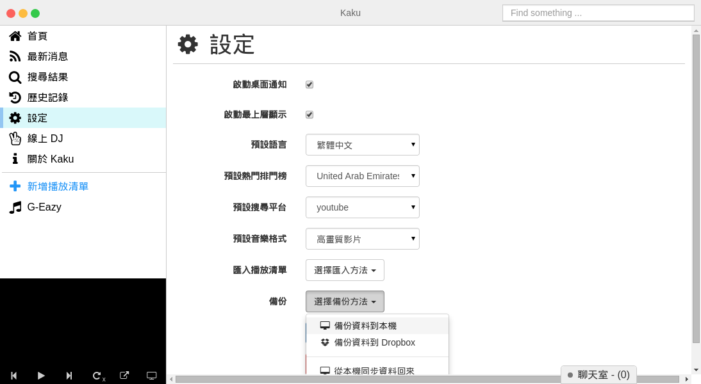
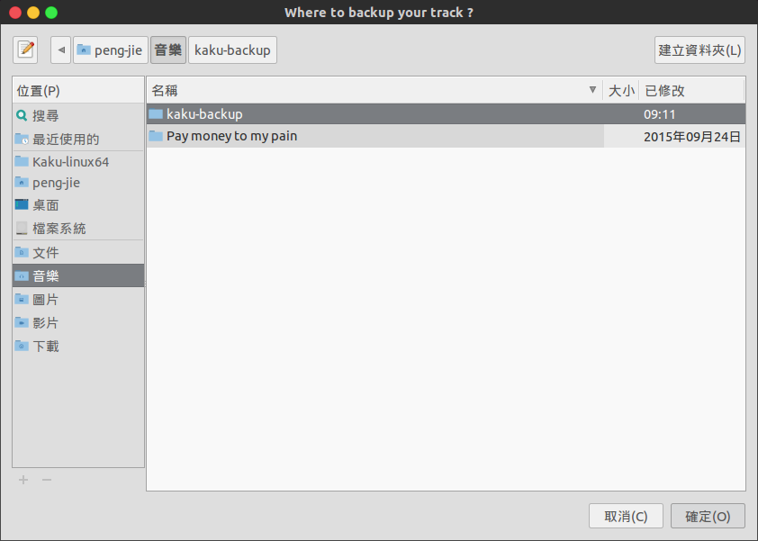
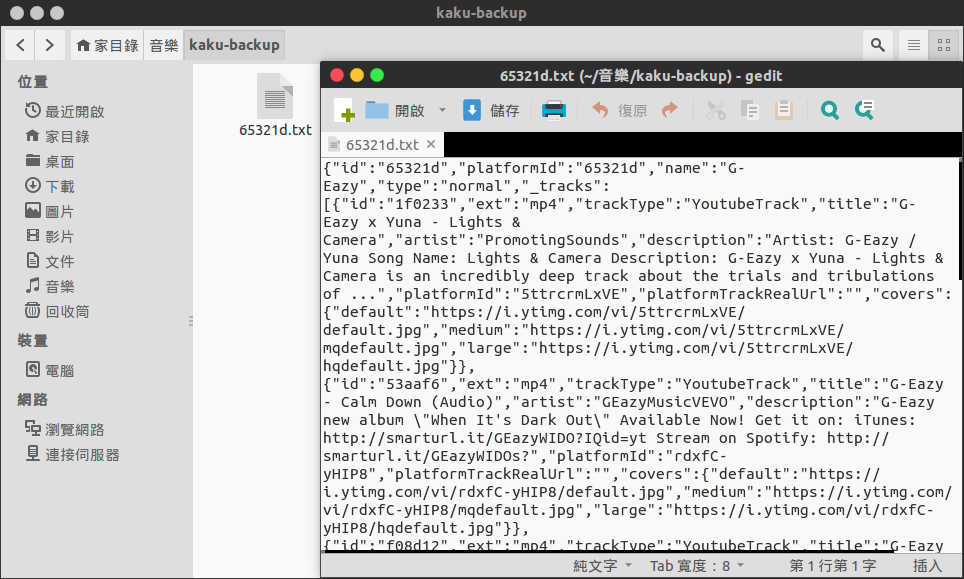
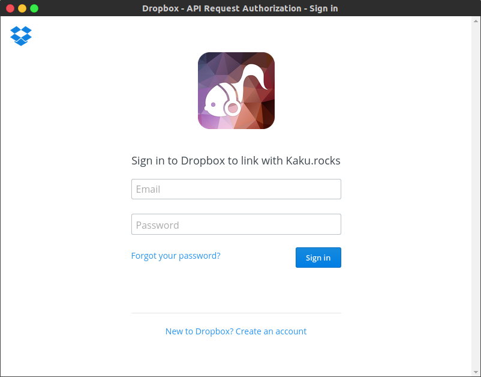
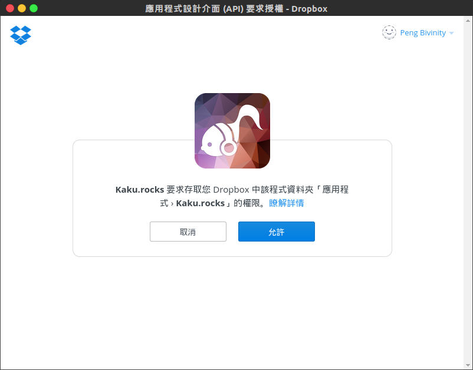
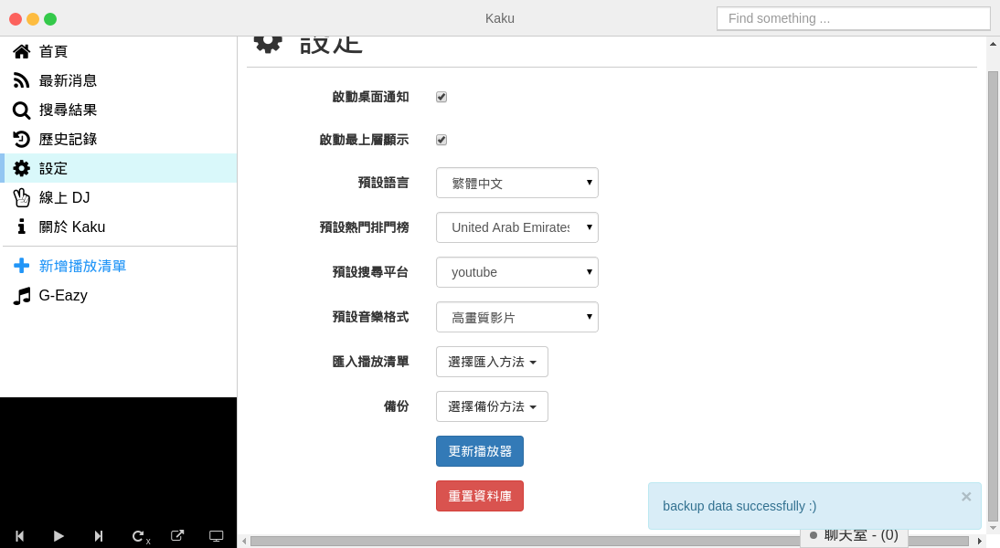
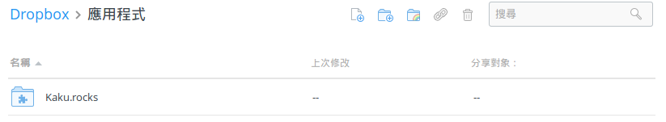

# 我該如何備份播放清單？

#### 首先，開啟 Kaku 後你可以在左下方看到你的播放清單

#### 接著，點選設定然後你可以看到備份的選項
你可以選擇你喜歡的備份方式，你可以備份到**本機**或 **Dropbox**。  

#### 備份到本機電腦
如果你選擇**備份資料到本機**，接著你可以設定你要儲存的位置。

#### 備份成功
備份完畢之後確認你存放的資料, 然後你可以到一個 **txt** 備份文字檔。  

看起來很簡單吧？如果我想要備份到 **Dropbox** 呢？  

### 備份到 Dropbox
回到設定，請選擇**備份資料到 Dropbox**然後你會看到 **Dropbox API 請求認證**。  
**請不要擔心，我們不會儲存你的任何資料！**

接著你可以看到授權的請求，請點下「允許」。

Kaku 會有**通知訊息**顯示儲存結果，接著你可以到你的 Dropbox 確認。

打開你的 Dropbox 後，打開**應用程式**資料夾你就可以看到你的音樂備份清單。

完成！Kaku 備份的方法很簡單，對吧？
