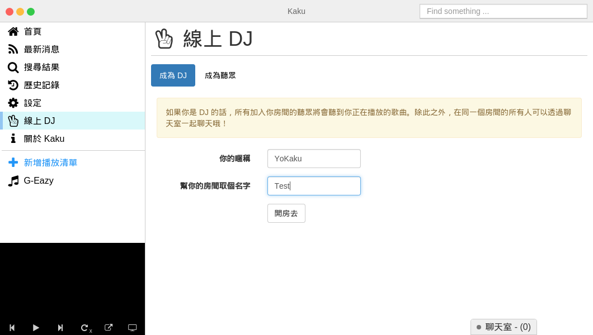
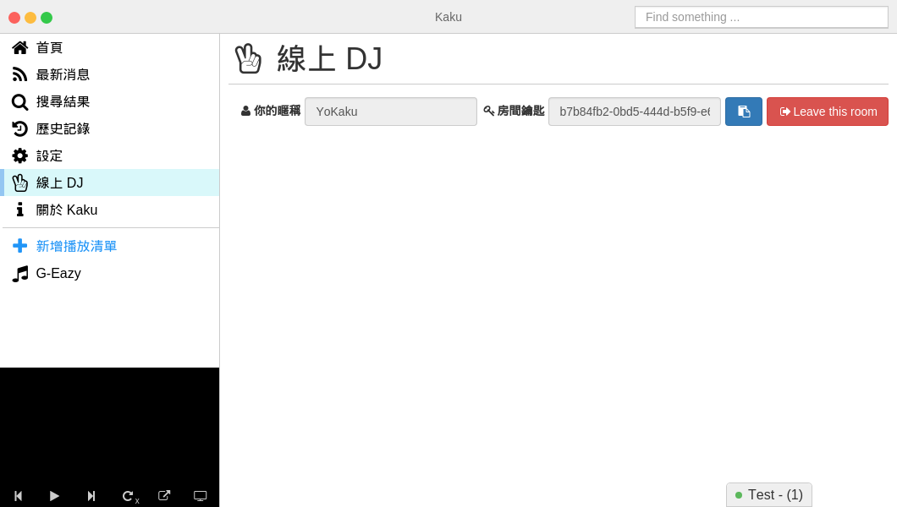
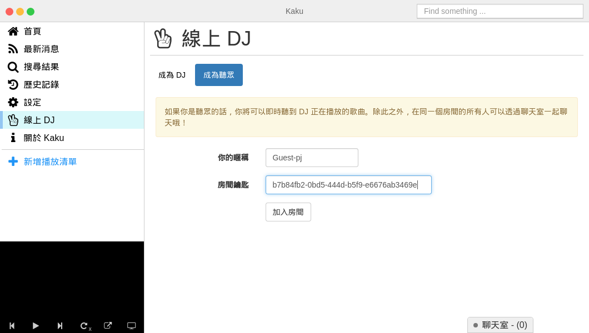
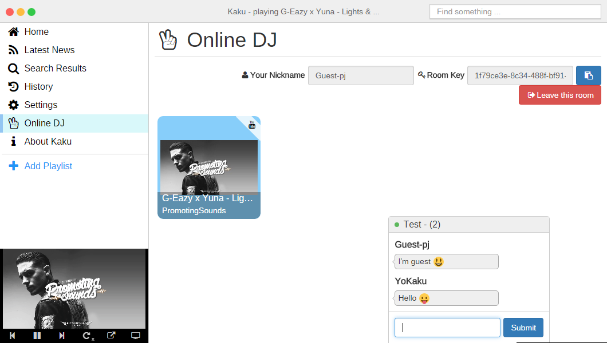

# 如何使用線上 DJ？

#### 請選擇你要成為 DJ
你可以設定你的`暱稱`和`房間名稱`就可以建立你的 DJ 房間了。

#### 取得房間金鑰
在建立 DJ 房間之後，你可以取得房間的金鑰，你可以將這個金鑰分享給你的朋友，讓他們加入你的 DJ 房間。

現在你已經是一位 DJ 了，你可以分享你的播放清單。
以下的情況是 demo 訪客的情況，你的朋友們可以加入你的 DJ 房間，而且你們還可以使用聊天室來聊天！

#### 訪客加入到 DJ 的房間
選擇`成為聽眾`，你可以設定你的`名稱`並且輸入`房間金鑰`然後就可以加入囉！

#### 成功加入到 DJ 的房間
很酷對吧！你可以和你的朋友一起聽音樂，還可以使用右下方的聊天室盡情的談論任何事情！

